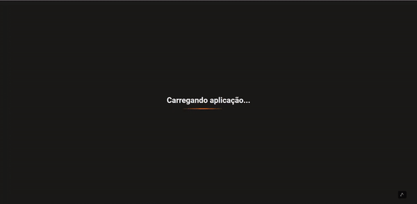

<p align="center">
  
</p>

# Upfi
   


<p align="center">
  
</p>

<p align="center">
  
</p>


* [Content (en-US)](#section-en_us)
* [Conteúdo (pt-BR)](#secao-pt_br)

---

## About the project <a id="section-en_us"></a>

Upfi is an image upload platform, where you can add and view images and gifs. When you click in an image, an modal opens with the image with its full size, and a link to view original file. The project uses React Query to search the FaunaDB and ImgBB API and display the images, implementing an infinite query that searches the data as requested by the user.

## Content
  * [Techs](#techs)
  * [How to run the project](#installation)
    * [Installation - Frontend](#installation-front)

## Techs <a id="techs"></a>

- [x] React
- [x] Next
- [x] ChakraUI
- [x] React Query

## How to execute the project <a id="installation"></a>
To execute the project, you'll need to have Node and NPM or Yarn installed to setup all the dependencies.


### Installation - Front-end (Web) <a id="installation-front"></a>

In the project root folder:

```bash
npm install
npm run start
```

If you are using Yarn, use this:
```bash
yarn install
yarn start
```

After finishing installation, the web page will be open in your browser.

---

## Sobre o projeto <a id="secao-pt_br"></a>

O Upfi é uma plataforma de upload de imagens, onde é possível adicionar e visualizar imagens e gifs. Quando você clica em uma imagem, um modal abre com a imagem em seu tamanho completo, e um link para ver o arquivo original. O projeto utiliza React Query para fazer buscas na API do FaunaDB e ImgBB e mostrar as imagens, implementando uma query infinita que busca os dados conforme são solicitados pelo usuário.

## Conteúdos
  * [Tecnologias](#tecnlogias)
  * [Como executar o projeto](#instalacao)
    * [Instalação - Front-end](#instalacao-front)

## Tecnologias <a id="tecnologias"></a>

- [x] React
- [x] Next
- [x] ChakraUI
- [x] React Query

## Como executar o projeto <a id="instalacao"></a>
Para executar o projeto, você irá precisar ter o Node e o NPM ou Yarn instalados para baixar as dependências.


### Instalação - Front-end (Web) <a id="instalacao-front"></a>

Na pasta raíz do repositório:

```bash
npm install
npm run dev
```

Se estiver usando Yarn, utilize
```bash
yarn install
yarn dev
```

Quando terminar, a página da aplicação web será aberta no navegador.

---
###### Developed by [Gean Lucas](https://www.linkedin.com/in/geanlucaas/) :rocket:.
